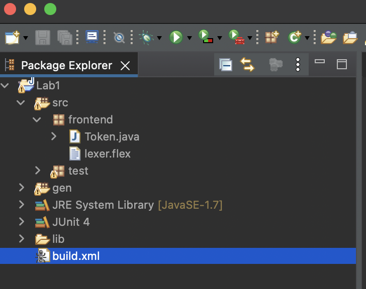
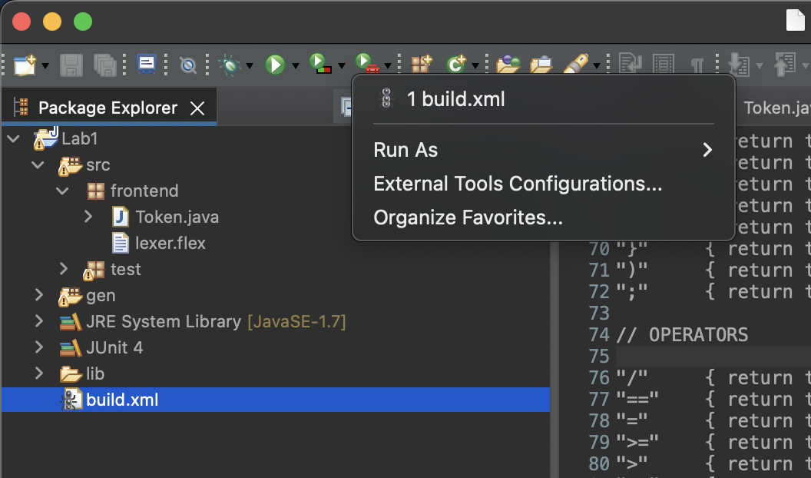
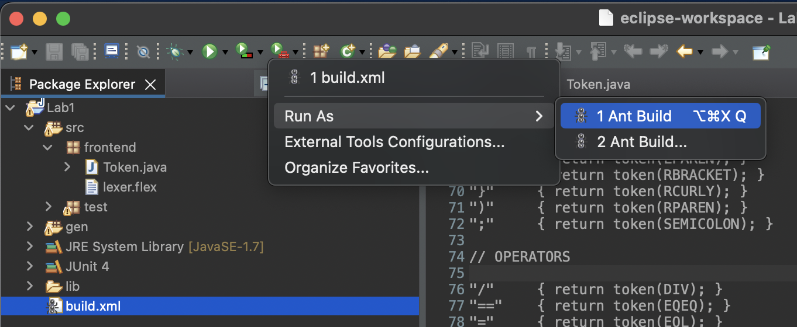
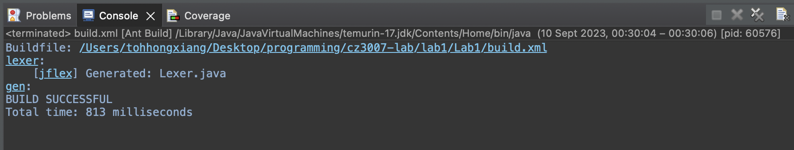
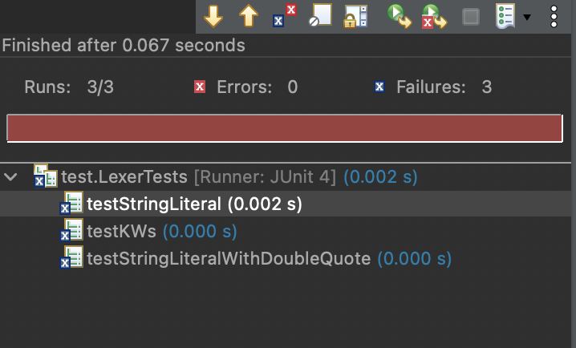
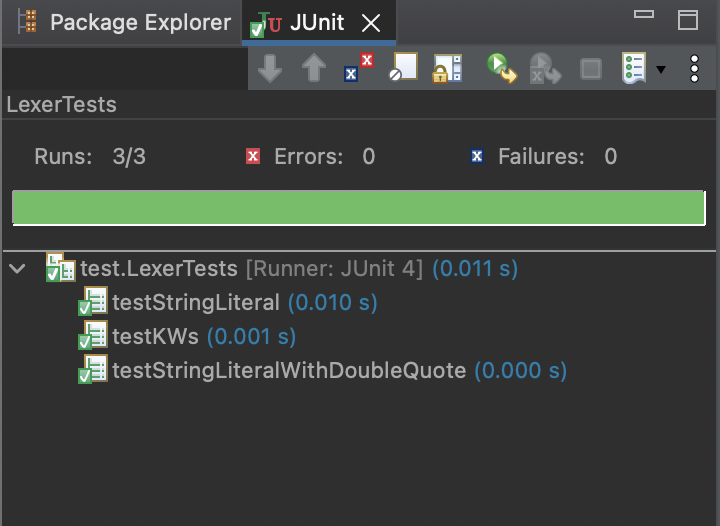

# Lab 1

# Initial Build

After following build instructions in the pdf, we need to build `lexer.flex`

To build `lexer.flex` into a java class, click on `./Lab1/build.xml`



Then, click on the downward black triangle on the "External Tools" button



If this is your first time running this project, you will not see `1 build.xml` in the menu. Hover over "Run as", and select "1 Ant Build"



Now, you will see in the console on the bottom of the screen that `Lexer.java` was successfully built



Now double click `./Lab1/src/tests/LexerTests.java` to open it in the editor. In the editor, right click on any empty space, click "Run As", and then click "1 JUnit Test"

Before filling in `lexer.flex` with the appropriate code, all the tests will fail



# Filling in `lexer.flex`

We create a method `token`, which is a simple utility method to help us create tokens. These are initially empty within `lexer.flex`, and we should fill it in with the appropriate java code:

```java
/* These two methods are for the convenience of rules to create token objects.
* If you do not want to use them, delete them
* otherwise add the code in 
*/

private Token token(Token.Type type) {
    return token(type, yytext()); // calls token(Token.Type, String) below
}

/* Use this method for rules where you need to process yytext() to get the lexeme of the token.
    *
    * Useful for string literals; e.g., the quotes around the literal are part of yytext(),
    *       but they should not be part of the lexeme. 
*/
private Token token(Token.Type type, String text) {
    return new Token(type, yyline, yycolumn, text); // actually creates the Token class
}
```

When we generate the `Lexer` class, we can actually see these 2 methods within it.

Now, we have to implement rules for `lexer.flex`. For each token type in the `Token` class, we have a corresponding method to actually create the token. The format is

```
[regex] { return token(...) }
```

- `[regex]` is the corresponding regex to match for the token
- Within the curly brackets is the code to generate the appropriate token

For example, 

```
"boolean"	{ return token(BOOLEAN); }
```

Create a method for every single possible token, then rebuild `lexer.flex`, and run the tests.

After filling in `lexer.flex` with the appropriate code, and building, the tests will be green.

